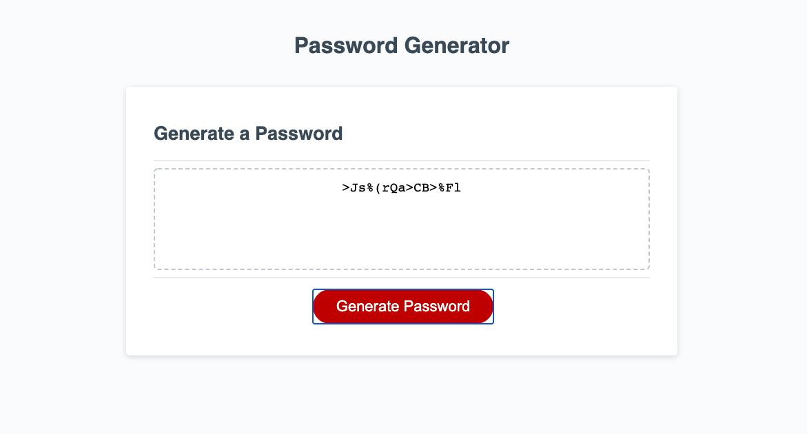

# Password Generator

## Overview

This project serves as a password generator, based on user input for the following criteria:

- How many characters the password should be
- If the password should include numbers
- If the password should include uppercase letters
- If the password should include lowercase letters
- If the password should include special characters

All front end design was given to me, my task was to create the logic to generate a valid password from the criteria above. 

## Link to deployed application:
[Password Generator](https://kelseybenedict.github.io/passwordgenerator.github.io/Develop/)